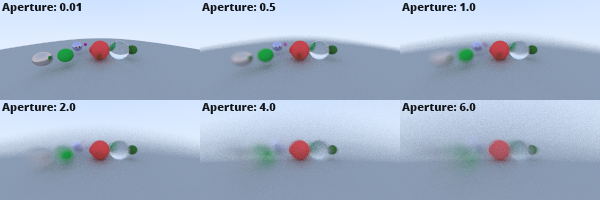
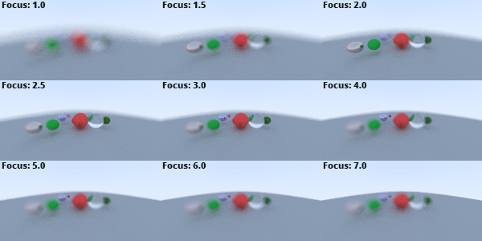

<h1>Ray Tracing in one weekend</h1>
Ray tracing implementation from the article "Ray Tracing in One Weekend" by Peter Shirley [<a href="https://www.realtimerendering.com/raytracing/Ray%20Tracing%20in%20a%20Weekend.pdf">Link</a>].

<h2>Screenshots</h2>
<h3>Aperture effects</h3>

<h3>Focal distance effects</h3>

<h2>License</h2>
MIT